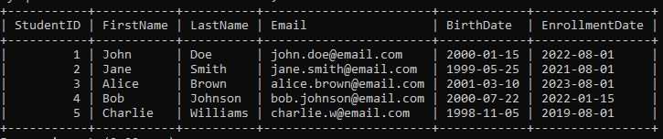
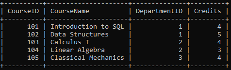
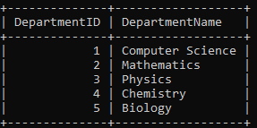
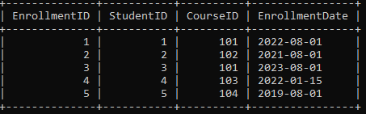
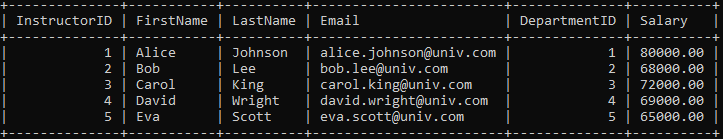

# 🎓 University Course Management System

<div align="center">

```
╔══════════════════════════════════════════════════════════════════╗
║        🏛️  UNIVERSITY COURSE MANAGEMENT SYSTEM                  ║
║               Final Project | SQL (MySQL)                        ║
║        📂  Database: UniversityCMS  |  License: MIT             ║
╚══════════════════════════════════════════════════════════════════╝
```


</div>

---

## 📑 Table of Contents

- [📖 Project Overview](#-project-overview)
- [🗂️ Repository Structure](#️-repository-structure)
- [🏗️ Database Schema](#️-database-schema)
- [📊 Tables & Screenshots](#-tables--screenshots)
  - [👨‍🎓 Students Table](#-students-table)
  - [📚 Courses Table](#-courses-table)
  - [🏛️ Departments Table](#️-departments-table)
  - [📋 Enrollments Table](#-enrollments-table)
  - [👨‍🏫 Instructors Table](#-instructors-table)
- [🔗 Entity Relationships](#-entity-relationships)
- [⚙️ Setup & Installation](#️-setup--installation)
- [🔍 Queries — Detailed Breakdown](#-queries--detailed-breakdown)
- [🛠️ Tech Stack](#️-tech-stack)
- [📊 Project Stats](#-project-stats)
- [📬 Author](#-author)

---

## 📖 Project Overview

The **University Course Management System** is a fully functional relational database project built with **MySQL**. It simulates a real-world university backend that manages students, instructors, departments, courses, and enrollments — all connected through a well-defined relational schema enforced with foreign key constraints.

This project demonstrates practical SQL skills including:

- ✅ **Database design** with normalized tables and foreign keys
- ✅ **CRUD operations** — INSERT, SELECT, UPDATE (INCREMENT/DECREMENT), DELETE
- ✅ **Aggregate functions** — `COUNT`, `AVG`, `MAX`, `SUM`
- ✅ **Joins** — `INNER JOIN`, `LEFT JOIN` across multiple tables
- ✅ **Set operations** — `UNION` and `INTERSECT` (via double join)
- ✅ **Subqueries** — single-level and deeply nested subqueries
- ✅ **Date functions** — `YEAR()`, `DATEDIFF()`, `CURDATE()`
- ✅ **String functions** — `CONCAT()`
- ✅ **Window functions** — `SUM() OVER (ORDER BY ...)`
- ✅ **CASE statements** — conditional labeling of records
- ✅ **30+ rows per table** of realistic sample data

---

## 🗂️ Repository Structure

```
📦 University_Course_Management_System/
│
├── 📄 University_Course_Management_System.sql   ← Main SQL file (all steps)
│
├── 📂 Tables/                                   ← Screenshots of all tables
│   ├── 🖼️  Students_Table.PNG
│   ├── 🖼️  Course_Table.PNG
│   ├── 🖼️  Departments_Table.PNG
│   ├── 🖼️  Enrollnment_Table.PNG
│   └── 🖼️  Instruction_Table.PNG
│
└── 📄 README.md                                 ← You are here!
```

---

## 🏗️ Database Schema

```
┌─────────────────┐          ┌──────────────────────┐
│   Departments   │          │      Instructors      │
│─────────────────│          │──────────────────────│
│ 🔑 DepartmentID │◄─────────│ 🔑 InstructorID      │
│    DeptName     │    │     │    FirstName          │
└─────────────────┘    │     │    LastName           │
         ▲             │     │    Email              │
         │             │     │ 🔗 DepartmentID       │
         │             │     │    Salary             │
         │             │     └──────────────────────┘
┌─────────────────┐    │
│     Courses     │    │
│─────────────────│    │
│ 🔑 CourseID     │    │
│    CourseName   │    │
│ 🔗 DepartmentID │────┘
│    Credits      │
└─────────────────┘
         ▲
         │
┌─────────────────┐          ┌─────────────────┐
│   Enrollments   │          │    Students     │
│─────────────────│          │─────────────────│
│ 🔑 EnrollmentID │          │ 🔑 StudentID    │
│ 🔗 StudentID    │◄─────────│    FirstName    │
│ 🔗 CourseID     │          │    LastName     │
│    EnrollDate   │          │    Email        │
└─────────────────┘          │    BirthDate    │
                             │    EnrollDate   │
                             └─────────────────┘
```

> 🔑 = Primary Key &nbsp;&nbsp;&nbsp; 🔗 = Foreign Key

---

## 📊 Tables & Screenshots

### 👨‍🎓 Students Table

> Stores personal details of all enrolled students. Each student has a unique `StudentID` and `Email`. The table holds **30 student records** spanning enrollment dates from 2017 to 2024.



| Column | Type | Constraint | Description |
|:------:|:----:|:----------:|:-----------:|
| `StudentID` | INT | PRIMARY KEY | Unique student identifier |
| `FirstName` | VARCHAR(50) | NOT NULL | Student's first name |
| `LastName` | VARCHAR(50) | NOT NULL | Student's last name |
| `Email` | VARCHAR(100) | UNIQUE, NOT NULL | Student's email address |
| `BirthDate` | DATE | NOT NULL | Date of birth |
| `EnrollmentDate` | DATE | NOT NULL | Date of university enrollment |

---

### 📚 Courses Table

> Contains all **30 available courses** offered across departments. Each course is linked to exactly one department and carries a specific credit value ranging from 3 to 5.



| Column | Type | Constraint | Description |
|:------:|:----:|:----------:|:-----------:|
| `CourseID` | INT | PRIMARY KEY | Unique course identifier (101–130) |
| `CourseName` | VARCHAR(100) | NOT NULL | Full name of the course |
| `DepartmentID` | INT | FOREIGN KEY | References `Departments(DepartmentID)` |
| `Credits` | INT | NOT NULL | Number of credit hours |

> 📌 **Sample Courses:** Introduction to SQL, Data Structures, Calculus I, Linear Algebra, Classical Mechanics, Machine Learning, Web Development, Quantum Mechanics, and more!

---

### 🏛️ Departments Table

> Master lookup table for all **10 academic departments** in the university. It is the parent table referenced by both `Courses` and `Instructors` via foreign keys.



| Column | Type | Constraint | Description |
|:------:|:----:|:----------:|:-----------:|
| `DepartmentID` | INT | PRIMARY KEY | Unique department identifier (1–10) |
| `DepartmentName` | VARCHAR(100) | NOT NULL | Full name of the academic department |

> 📌 **All 10 Departments:** Computer Science, Mathematics, Physics, Chemistry, Biology, English Literature, History, Economics, Mechanical Engineering, Civil Engineering.

---

### 📋 Enrollments Table

> The **bridge/junction table** connecting `Students` and `Courses`. This table implements the many-to-many relationship — a student can enroll in multiple courses, and a course can have many students.



| Column | Type | Constraint | Description |
|:------:|:----:|:----------:|:-----------:|
| `EnrollmentID` | INT | PRIMARY KEY | Unique enrollment record identifier |
| `StudentID` | INT | FOREIGN KEY | References `Students(StudentID)` |
| `CourseID` | INT | FOREIGN KEY | References `Courses(CourseID)` |
| `EnrollmentDate` | DATE | NOT NULL | Date the student enrolled in this course |

> 🔗 **Design Note:** This is a classic **many-to-many** relationship implemented via a junction table. Without this table, relational databases cannot directly model students ↔ courses connections.

---

### 👨‍🏫 Instructors Table

> Stores full details about **30 faculty members**, including their department affiliations and salary figures. Salary data is used in aggregate queries (MAX, comparisons).



| Column | Type | Constraint | Description |
|:------:|:----:|:----------:|:-----------:|
| `InstructorID` | INT | PRIMARY KEY | Unique instructor identifier |
| `FirstName` | VARCHAR(50) | NOT NULL | Instructor's first name |
| `LastName` | VARCHAR(50) | NOT NULL | Instructor's last name |
| `Email` | VARCHAR(100) | UNIQUE, NOT NULL | Instructor's official university email |
| `DepartmentID` | INT | FOREIGN KEY | References `Departments(DepartmentID)` |
| `Salary` | DECIMAL(10,2) | DEFAULT 50000.00 | Monthly salary (ranges from $60K to $82K) |

---

## 🔗 Entity Relationships

| 🔗 Relationship | 🔄 Type | 📝 Description |
|:--------------:|:-------:|:--------------:|
| Students ↔ Enrollments | One-to-Many | One student can have many enrollment records |
| Courses ↔ Enrollments | One-to-Many | One course can have many enrollment records |
| Departments ↔ Courses | One-to-Many | One department offers many courses |
| Departments ↔ Instructors | One-to-Many | One department employs many instructors |
| Students ↔ Courses | **Many-to-Many** | Implemented via `Enrollments` junction table |

---

## ⚙️ Setup & Installation

Follow these steps to get the project running locally on your machine 🖥️

**Step 1 — Prerequisites**
```bash
# Ensure MySQL is installed (version 5.7+ or 8.0+ recommended)
mysql --version
```

**Step 2 — Clone the Repository**
```bash
git clone https://github.com/your-username/University_Course_Management_System.git
cd University_Course_Management_System
```

**Step 3 — Run the SQL File**
```bash
# Login to MySQL
mysql -u root -p

# Inside MySQL shell, execute the project file
source University_Course_Management_System.sql;
```

**Step 4 — Verify Setup**
```sql
USE UniversityCMS;
SHOW TABLES;

SELECT COUNT(*) FROM Students;      -- Expected: 30
SELECT COUNT(*) FROM Courses;       -- Expected: 30
SELECT COUNT(*) FROM Instructors;   -- Expected: 30
SELECT COUNT(*) FROM Enrollments;   -- Expected: 30
SELECT COUNT(*) FROM Departments;   -- Expected: 10
```

> ✅ If all counts match, your database is fully configured and ready for all 16 queries!

---

## 🔍 Queries — Detailed Breakdown

The project includes **16 carefully crafted SQL queries** covering a wide range of real-world database operations. Each query is explained with code, purpose, and what SQL concepts it demonstrates.

---

### Query 1 — CRUD Operations

> 📌 **Concept:** The four fundamental database operations — Create, Read, Update (INCREMENT & DECREMENT), Delete.

```sql
-- ➕ CREATE: Add a new student
INSERT INTO Students VALUES (31, 'New', 'Student', 'new@email.com', '2003-01-01', '2025-08-01');

-- 📖 READ: View all records
SELECT * FROM Students;

-- ✏️ UPDATE INCREMENT: Give CS department instructors a $5,000 raise
UPDATE Instructors SET Salary = Salary + 5000 WHERE DepartmentID = 1;

-- ✏️ UPDATE DECREMENT: Reduce salary for instructors earning above $80,000
UPDATE Instructors SET Salary = Salary - 2000 WHERE Salary > 80000;

-- ❌ DELETE: Remove the test student record
DELETE FROM Students WHERE StudentID = 31;
```

**💡 What it demonstrates:** Full CRUD lifecycle, safe conditional UPDATE and DELETE, INCREMENT and DECREMENT salary patterns.

---

### Query 2 — Filter by Enrollment Date

> 📌 **Concept:** Date-based row filtering using `WHERE` with `ORDER BY`.

```sql
SELECT StudentID, FirstName, LastName, EnrollmentDate
FROM Students
WHERE EnrollmentDate > '2022-12-31'
ORDER BY EnrollmentDate;
```

**💡 What it demonstrates:** Date comparison in WHERE clause, chronological sorting, isolating students who joined after 2022.

---

### Query 3 — Department-wise Courses

> 📌 **Concept:** Filtering by a foreign key value and capping results with `LIMIT`.

```sql
SELECT CourseID, CourseName, Credits
FROM Courses
WHERE DepartmentID = 2        -- Mathematics department
ORDER BY CourseID
LIMIT 5;
```

**💡 What it demonstrates:** Filtering on FK columns, `LIMIT` for result capping, foundation for pagination-style queries.

---

### Query 4 — GROUP BY with HAVING

> 📌 **Concept:** Counting enrollments per course and filtering groups to show only popular courses (more than 5 students).

```sql
SELECT c.CourseID, c.CourseName, COUNT(e.StudentID) AS TotalStudents
FROM Courses c
JOIN Enrollments e ON c.CourseID = e.CourseID
GROUP BY c.CourseID, c.CourseName
HAVING COUNT(e.StudentID) > 5
ORDER BY TotalStudents DESC;
```

**💡 What it demonstrates:** `GROUP BY` aggregation, `HAVING` for post-grouping filters (unlike `WHERE` which filters rows before grouping), `COUNT()` aggregation, descending sort by computed column.

---

### Query 5 — INTERSECT (Students Enrolled in Both Courses)

> 📌 **Concept:** Finding students enrolled in **Course 101 AND Course 102** simultaneously — MySQL-compatible INTERSECT via double JOIN.

```sql
SELECT s.StudentID, s.FirstName, s.LastName
FROM Students s
JOIN Enrollments e1 ON s.StudentID = e1.StudentID AND e1.CourseID = 101
JOIN Enrollments e2 ON s.StudentID = e2.StudentID AND e2.CourseID = 102;
```

**💡 What it demonstrates:** Simulating INTERSECT in MySQL (no native INTERSECT keyword), self-joining Enrollments twice with different filters, finding the overlap between two sets of students.

---

### Query 6 — UNION (Students in Either Course)

> 📌 **Concept:** Merging results from two separate SELECT queries into one combined result set using `UNION`.

```sql
SELECT s.StudentID, s.FirstName, s.LastName, 'Intro to SQL' AS CourseName
FROM Students s JOIN Enrollments e ON s.StudentID = e.StudentID WHERE e.CourseID = 101

UNION

SELECT s.StudentID, s.FirstName, s.LastName, 'Data Structures' AS CourseName
FROM Students s JOIN Enrollments e ON s.StudentID = e.StudentID WHERE e.CourseID = 102
ORDER BY StudentID;
```

**💡 What it demonstrates:** `UNION` combining two result sets, column count must match across both SELECTs, automatic deduplication (vs `UNION ALL`), literal column value using `AS`.

---

### Query 7 — AVG Credits

> 📌 **Concept:** Calculating the average credit value across all courses using the `AVG()` aggregate function.

```sql
SELECT AVG(Credits) AS AverageCredits
FROM Courses;
```

**💡 What it demonstrates:** `AVG()` for numerical column analysis, clean column aliasing with `AS`, concise single-line analytics query.

---

### Query 8 — MAX Salary

> 📌 **Concept:** Finding the highest salary among Computer Science instructors using `MAX()`.

```sql
SELECT MAX(Salary) AS MaxSalary
FROM Instructors
WHERE DepartmentID = 1;    -- Computer Science only
```

**💡 What it demonstrates:** `MAX()` scoped to a filtered subset, combining aggregate functions with `WHERE`, department-specific salary analytics.

---

### Query 9 — Students per Department

> 📌 **Concept:** Counting unique students in each academic department via a three-table JOIN chain.

```sql
SELECT d.DepartmentName, COUNT(DISTINCT e.StudentID) AS StudentCount
FROM Departments d
JOIN Courses     c ON d.DepartmentID = c.DepartmentID
JOIN Enrollments e ON c.CourseID     = e.CourseID
GROUP BY d.DepartmentID, d.DepartmentName
ORDER BY StudentCount DESC;
```

**💡 What it demonstrates:** Three-table JOIN chain (Departments → Courses → Enrollments), `COUNT(DISTINCT ...)` to prevent double-counting students in multiple courses, ranking by popularity with `DESC`.

---

### Query 10 — INNER JOIN

> 📌 **Concept:** Retrieving only students who have an enrollment record — matching rows across three tables.

```sql
SELECT s.StudentID, s.FirstName, s.LastName, c.CourseName, e.EnrollmentDate
FROM Students    s
INNER JOIN Enrollments e ON s.StudentID = e.StudentID
INNER JOIN Courses     c ON e.CourseID  = c.CourseID
ORDER BY s.StudentID;
```

**💡 What it demonstrates:** `INNER JOIN` returning only matched rows, students with no enrollments are excluded, chaining two JOINs across three tables, the most common join for transactional reports.

---

### Query 11 — LEFT JOIN

> 📌 **Concept:** Retrieving ALL students — including those not enrolled in any course — using `LEFT JOIN`.

```sql
SELECT s.StudentID, s.FirstName, s.LastName, c.CourseName
FROM Students    s
LEFT JOIN Enrollments e ON s.StudentID = e.StudentID
LEFT JOIN Courses     c ON e.CourseID  = c.CourseID
ORDER BY s.StudentID;
```

**💡 What it demonstrates:** `LEFT JOIN` preserves ALL rows from the left (driving) table, unenrolled students show `NULL` for CourseName, essential for identifying students with missing records.

---

### Query 12 — Nested Subquery (3 Levels Deep)

> 📌 **Concept:** Using a subquery inside a subquery to identify students enrolled in high-demand courses (more than 10 students).

```sql
SELECT StudentID, FirstName, LastName
FROM Students
WHERE StudentID IN (
    SELECT e.StudentID FROM Enrollments e
    WHERE e.CourseID IN (
        SELECT CourseID FROM Enrollments
        GROUP BY CourseID
        HAVING COUNT(StudentID) > 10
    )
);
```

**💡 What it demonstrates:** Three levels of nesting — innermost finds popular course IDs, middle finds enrolled student IDs, outer returns full student details. `IN` for set membership testing across nested queries.

---

### Query 13 — YEAR() Date Function

> 📌 **Concept:** Extracting just the year component from `EnrollmentDate` for display and sorting.

```sql
SELECT StudentID, FirstName, LastName, EnrollmentDate,
       YEAR(EnrollmentDate) AS EnrollmentYear
FROM Students
ORDER BY EnrollmentYear;
```

**💡 What it demonstrates:** `YEAR()` date extraction function, creating a derived computed column, sorting by extracted year, foundation for year-over-year trend analysis.

---

### Query 14 — CONCAT() String Function

> 📌 **Concept:** Combining `FirstName` and `LastName` columns into a single display-ready `FullName` string.

```sql
SELECT InstructorID,
       CONCAT(FirstName, ' ', LastName) AS FullName,
       Email, DepartmentID
FROM Instructors
ORDER BY InstructorID;
```

**💡 What it demonstrates:** `CONCAT()` merging multiple columns with a space separator, computed virtual columns with `AS`, practical for generating report-ready or display-ready output.

---

### Query 15 — Window Function (Running Total)

> 📌 **Concept:** Calculating a cumulative running count of all enrollments using an SQL Window Function.

```sql
SELECT e.EnrollmentID, e.CourseID, c.CourseName, e.StudentID,
       e.EnrollmentDate,
       SUM(1) OVER (ORDER BY e.EnrollmentID) AS RunningTotalStudents
FROM Enrollments e
JOIN Courses c ON e.CourseID = c.CourseID
ORDER BY e.EnrollmentID;
```

**💡 What it demonstrates:** `SUM() OVER (ORDER BY ...)` Window Function, running total grows by 1 per row, unlike `GROUP BY` — all rows are preserved in output, one of the most powerful modern SQL features for time-series and trend analytics.

---

### Query 16 — CASE Statement (Student Level Classification)

> 📌 **Concept:** Labeling every student as `Senior` or `Junior` based on how long ago they enrolled, using `CASE` + `DATEDIFF` + `CURDATE`.

```sql
SELECT StudentID, FirstName, LastName, EnrollmentDate,
       CASE
           WHEN DATEDIFF(CURDATE(), EnrollmentDate) > (4 * 365) THEN 'Senior'
           ELSE 'Junior'
       END AS StudentLevel
FROM Students
ORDER BY StudentID;
```

**💡 What it demonstrates:** `CASE...WHEN...THEN...ELSE...END` — SQL's conditional branching, `DATEDIFF()` computing day-difference between two dates, `CURDATE()` fetching today's date dynamically so the query stays accurate over time.

---

## 🛠️ Tech Stack

| 🔧 Tool | 💡 Purpose |
|:-------:|:----------:|
| 🐬 MySQL 8.0+ | Primary relational database engine |
| 🖥️ MySQL Workbench | SQL IDE for writing and executing queries |
| 💻 MySQL CLI | Terminal-based query execution & verification |
| 📄 `.sql` Script File | Portable, version-controllable project source |
| 📂 GitHub | Version control and project hosting |

---

## 📊 Project Stats

```
╔══════════════════════════════════════════════════╗
║           📊  PROJECT STATISTICS                 ║
╠══════════════════════════════════════════════════╣
║  📦 Database Name    : UniversityCMS             ║
║  📋 Total Tables     : 5                         ║
║  📝 SQL Build Steps  : 4 (DB → Tables → Data     ║
║                          → Queries)              ║
║  🔢 Sample Records   : 30+ rows per table        ║
║                        (150+ total records)      ║
║  🔍 Total Queries    : 16                        ║
║  🔗 Foreign Keys     : 4 enforced relationships  ║
╠══════════════════════════════════════════════════╣
║  ⚙️  SQL Features Used:                          ║
║     DDL, DML, DQL, Aggregate Functions,          ║
║     INNER JOIN, LEFT JOIN, UNION,                ║
║     INTERSECT (via JOIN), Nested Subqueries,     ║
║     Date Functions, String Functions,            ║
║     Window Functions, CASE Statements            ║
╚══════════════════════════════════════════════════╝
```

---

## ✨ Concepts Coverage Checklist

| 🏷️ SQL Concept | ✅ Status |
|:--------------:|:--------:|
| CREATE DATABASE & USE | ✅ Done |
| CREATE TABLE with PK & FK | ✅ Done |
| INSERT with 30+ rows per table | ✅ Done |
| SELECT with WHERE & ORDER BY | ✅ Done |
| UPDATE — INCREMENT & DECREMENT | ✅ Done |
| DELETE with condition | ✅ Done |
| INNER JOIN (multi-table) | ✅ Done |
| LEFT JOIN | ✅ Done |
| UNION | ✅ Done |
| INTERSECT (via double JOIN) | ✅ Done |
| Nested Subquery (3 levels) | ✅ Done |
| GROUP BY + HAVING | ✅ Done |
| COUNT(), AVG(), MAX(), SUM() | ✅ Done |
| YEAR(), DATEDIFF(), CURDATE() | ✅ Done |
| CONCAT() | ✅ Done |
| Window Function — SUM OVER | ✅ Done |
| CASE Statement | ✅ Done |
| LIMIT clause | ✅ Done |

---

## 📬 Author

<div align="center">

> 💬 *"Data is the new oil — SQL is the refinery that makes it useful."*

| 🏷️ Detail | 📌 Info |
|:---------:|:-------:|
| 🗂️ Project | University Course Management System |
| 📚 Subject | SQL — Final Project |
| 🐬 Language | MySQL 8.0+ |
| 📄 License | MIT |

</div>

---

<div align="center">

### ⭐ If this project helped you learn SQL better, please give it a Star! ⭐

```
╔════════════════════════════════════════╗
║   🎓 University Course Management      ║
║      System — Built with ❤️ and SQL    ║
╚════════════════════════════════════════╝
```

</div>
